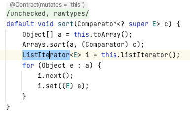
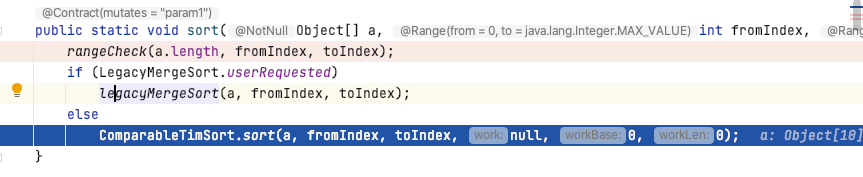
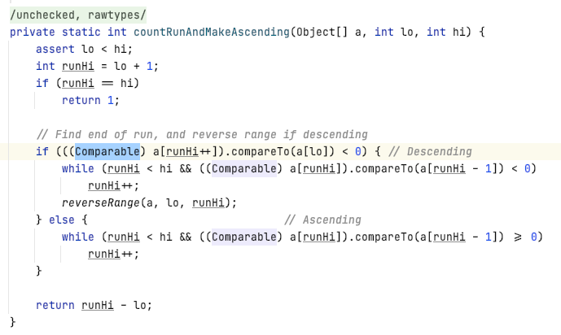
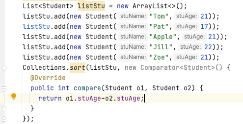

# Internal comparison
Implement the comparison inside the class. For example, we define a class Person. There are two fields in the class name and age.
```js
public class Person {
	String name;
	int age;

	public Person(String name, int age) {
		this.name = name;
		this.age = age;
	}
}
```

We want to compare two Person object by their age. How to do that? First, we should implement the interface Comparable. Then, we can overwrite the method compareTo. The return value of compareTo should be one of the value of (-1,0,1), as this object is less than, equal to, or greater than the specified object.
```js
o1.comparTo(o2) == -1 // means o1 < o2
o1.comparTo(o2) == 0 // means o1 = o2
o1.comparTo(o2) == 1 // means o1 > o2
```
```js
public class Person implements Comparable{
	String name;
	int age;

	public Person(String name, int age) {
		this.name = name;
		this.age = age;
	}

	@Override
	public int compareTo(Object o){
		Person p = (Person)o;
		if(this.age==p.age){ // if 2 people have the same age, use lexicographically sorting
			return this.name.compareTo(p.name);
		}
		return this.age - p.age; // ascending order sort by age
	}
}
```

Then, we have a test:
```js
public static void main(String[] args) {
		List<Person> list = new ArrayList<>();
		list.add(new Person("Tom",21));
		list.add(new Person("Pat",17));
		list.add(new Person("Apple",21));
		list.add(new Person("Jill",22));
		list.add(new Person("Zoe",21));

		Collections.sort(list);

		StringBuilder sb = new StringBuilder();
		for(Person p:list){
			sb.append(p.name);
			sb.append("; ");
		}
		System.out.println(sb.toString());
	}
```

The result is: Pat; Apple; Tom; Zoe; Jill; 

So What happened after we call Collections.sort(list).
Actually, the Collections.sort() is based on the Arrays.sort.


In the Arrays.sort, it calls ComparableTimSort.sort(a, fromIndex, toIndex, null, 0, 0);


In the ComparableTimSort.sort method, it calls countRunAndMakeAscending to make sure the array turns to an ascending order.



# External comparison
By creating a new class to specifically implement its comparison.


if you want to sort the string by lexicographical order, you can code like this:
```js
Collections.sort(listStu, new Comparator<Student>() {
			@Override
			public int compare(Student o1, Student o2) {
				return o1.stuName.compareTo(o2.stuName);
			}
		});
```

If you want to sort the double field, you can use the static method in Double:
```js
Collections.sort(listStu, new Comparator<Student>() {
			@Override
			public int compare(Student o1, Student o2) {
				return Double.compare(o1.time, o2.time);
			}
		});
```