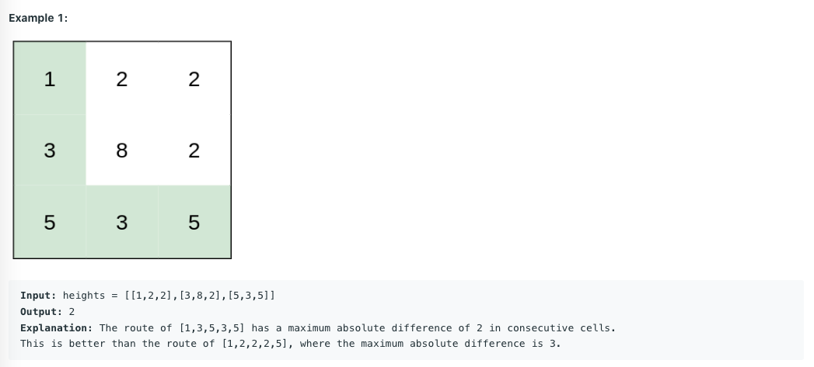

> You are a hiker preparing for an upcoming hike. You are given heights, a 2D array of size rows x columns, where heights[row][col] represents the height of cell (row, col). You are situated in the top-left cell, (0, 0), and you hope to travel to the bottom-right cell, (rows-1, columns-1) (i.e., 0-indexed). You can move up, down, left, or right, and you wish to find a route that requires the minimum effort.
> A route's effort is the maximum absolute difference in heights between two consecutive cells of the route.
> Return the minimum effort required to travel from the top-left cell to the bottom-right cell.



Dijkstra is an algorithm for finding the shorest path from the start node to the end node in a graph. In some common problem the shortest path means the smallest sum of the weight in the path. However, in this problem, the shortest path means the maximum difference between two adjacent node in a path.

> Math.abs(curHeight-nextHeight)

How do I come up with the solution using Dijkstra? We can use Dijkstra when meeting the three requirements.
1. the graph is weighted directed graph.
2. no negative weight edges
3. return the shortest path

In this question, the weight means the absolute value of the height difference, remaining positive. Also, we can go to the 4 direction in the metrix. We can recognize it as a directed graph.

```js
public class Solution {
	public int minimumEffortPath(int[][] heights) {
		int[][] dirs = new int[][]{{0,1},{1,0},{-1,0},{0,-1}};
		int[] minHeightDifference = new int[heights.length * heights[0].length];

		Arrays.fill(minHeightDifference,Integer.MAX_VALUE);

		PriorityQueue<State> pq = new PriorityQueue<>(new Comparator<State>() {
			@Override
			public int compare(State o1, State o2) {
				return o1.getHeightDiff()-o2.getHeightDiff();
			}
		});
		pq.add(new State(0,0,0));
		minHeightDifference[0] = 0;
		int result = Integer.MAX_VALUE;
		while(!pq.isEmpty()){
			State tmpState = pq.poll();
			int tmpx = tmpState.getX();
			int tmpy = tmpState.getY();
			int tmpHeightDiff =  tmpState.getHeightDiff();

			if(tmpx == heights[0].length-1 && tmpy == heights.length-1){
				result = Math.min(result, tmpHeightDiff);
				continue;
			}
			if(tmpHeightDiff > minHeightDifference[tmpy * heights[0].length + tmpx]){
				continue;
			}

			for(int i = 0;i<dirs.length;i++){
				int nextx = tmpx + dirs[i][0];
				int nexty = tmpy + dirs[i][1];
				if(nextx < heights[0].length && nextx >= 0 && nexty < heights.length && nexty >= 0){
					int nextDist = Math.max(minHeightDifference[tmpy * heights[0].length + tmpx],Math.abs(heights[tmpy][tmpx]-heights[nexty][nextx]));
					if(minHeightDifference[nexty * heights[0].length + nextx] > nextDist) {
						minHeightDifference[nexty * heights[0].length + nextx] = nextDist;
						pq.add(new State(nextx, nexty, nextDist));
					}
				}
			}
		}
		return result;
	}

//	public static void main(String[] args) {
//		Solution s = new Solution();
//		System.out.println(s.minimumEffortPath(new int[][]{{1,2,2},{3,8,2},{5,3,5}}));
//	}
}

class State{
	private int x;
	private int y;
	private int heightDiff;

	public State(int x, int y, int heightDiff) {
		this.x = x;
		this.y = y;
		this.heightDiff = heightDiff;
	}

	public int getX() {
		return x;
	}

	public void setX(int x) {
		this.x = x;
	}

	public int getY() {
		return y;
	}

	public void setY(int y) {
		this.y = y;
	}

	public int getHeightDiff() {
		return heightDiff;
	}

	public void setHeightDiff(int height) {
		this.heightDiff = height;
	}
}
```


