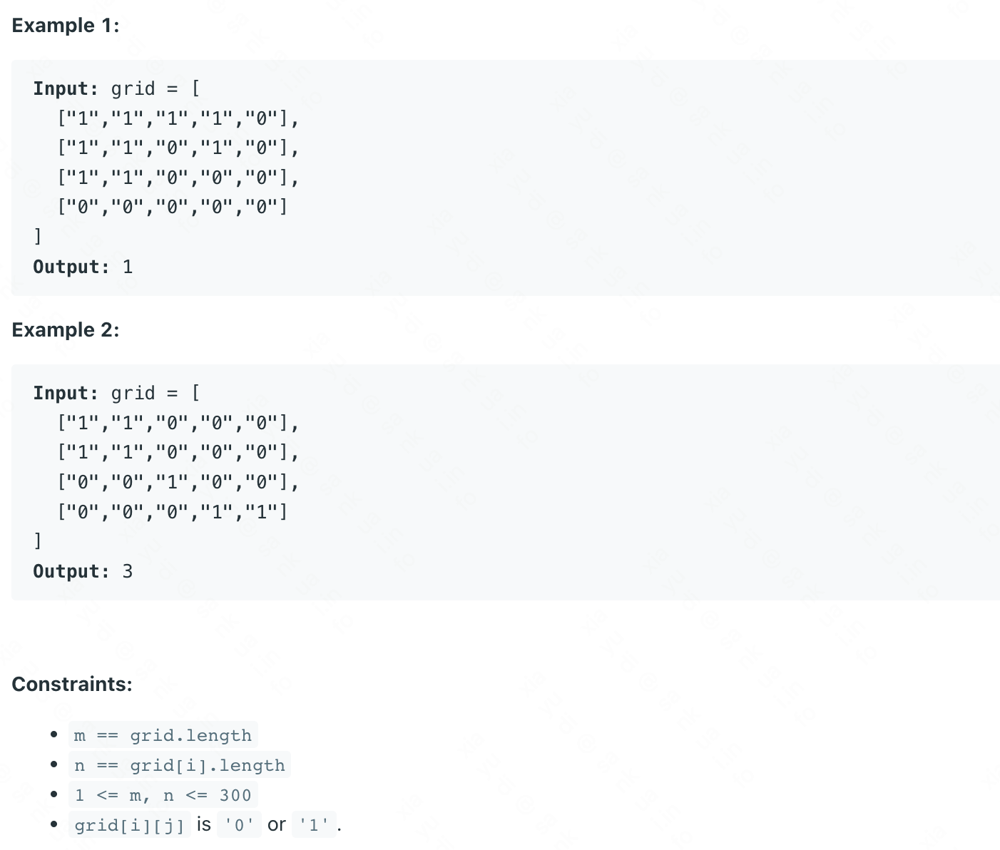

> Given an m x n 2D binary grid grid which represents a map of '1's (land) and '0's (water), return the number of islands.
> An island is surrounded by water and is formed by connecting adjacent lands horizontally or vertically. You may assume all four edges of the grid are all surrounded by water.




The common solution for this problem is DFS or BFS. However,  most of problem solved by DFS or BFS can also be solved by Union Find. 

### Key Point 1

The fundamental data structure for Union Find is ** int[] parents **. How to transform the matrix into array is one of the key points. We can use ** i * grid[0].length + j ** to note the index in array of every node in matrix.

### Key Point 2

The template code of Union Find should initial the value of parents and count, like this:

```clike
for(int i = 0; i < n; i++){
    parents[i] = i;
}
count = n; // count must be the number of '1'
```

In order to get the value count, we should traverse ** grid[][] ** twice. I dont want to do that. I think we can initial the parents[] , count and union the node simultaneously. I add a function preUnion(). I call this function before I call the union().

```clike
class Solution {
	public int numIslands(char[][] grid) {
		int[][] dirs = new int[][]{{1,0},{0,1}};
		int n = grid.length;
		int m = grid[0].length;
		UF uf = new UF(n * m);
		for(int i = 0;i< n;i++){
			for(int j = 0;j<m;j++){
				if(grid[i][j]=='0'){
					continue;
				}

				uf.preUnion(i * m + j);
				for(int k = 0;k< dirs.length;k++){
					int tmpi = i - dirs[k][0];
					int tmpj = j - dirs[k][1];
					if(tmpi<n && tmpi >= 0 && tmpj<m && tmpj >= 0 && grid[tmpi][tmpj]=='1'){
						uf.union(i*m+j,tmpi * m + tmpj);
						continue;
					}
				}
			}
		}
		return uf.getCount();
	}
}

class UF{
	int count;
	int[] parents;
	public UF(int n){
		parents = new int[n];
		Arrays.fill(parents, -1);
		count = 0;
	}

	public void preUnion(int index){
		parents[index] = index;
		count++;
	}

	public int find(int p){
		if(p!=parents[p]){
			parents[p] = find(parents[p]);
		}
		return parents[p];
	}

	public void union(int p, int q){
		int pRoot = find(p);
		int qRoot = find(q);
		if(qRoot==pRoot){
			return ;
		}
		parents[pRoot] = qRoot;
		count--;
	}

	public int getCount(){
		return count;
	}
}
```
