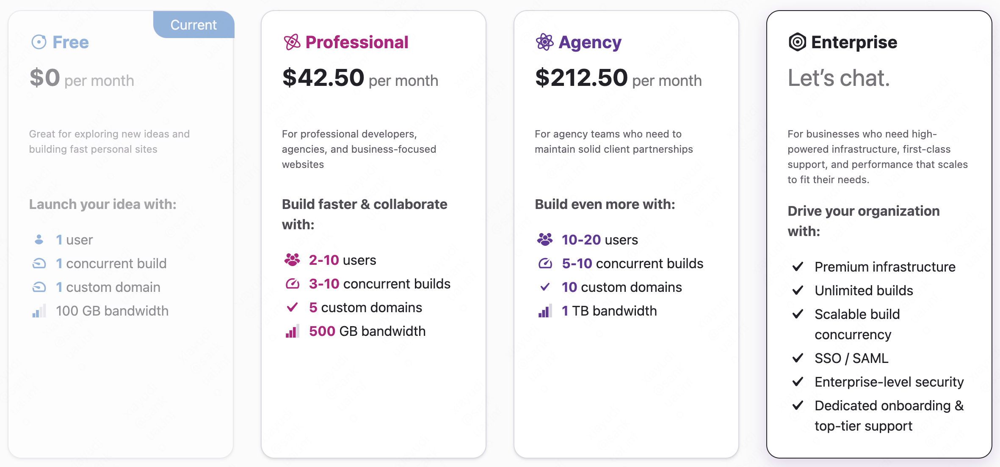

> Hi welcome to my first personal website~ 🥰💖

# 1. A Brief Introduction
Right now my website only have three pages, namely the [Home Page](/), the [Blog List Page](/blog) and the Blog Detail Page. Maybe I will add new pages and functions in the future. (If I have the idle time in the future 😬)

## [Home Page](/)
In my Home Page, I posted an introduction of myself, a breif resume. You can find my contact in the end of the Home Page. Welcome to communicate with me and make friends with me.  

## [Blog List Page](/blog)
You can see the whole list of my blog in this page.

I plan to post some blogs from time to time. In the past, I wrote down my opinion and notes in some open source documentation application like [YuQue](https://www.yuque.com) or [OneNote](https://www.onenote.com). Now I've found that it's also a good option to document it in my own blog.

## [Blog Detail Page](/blog/my-first-post/)
This is my Blog Detail Page. In this page, I have access to [utteranc](https://utteranc.es/), a lightweight comments widget built on GitHub issues. Once you make a comment, it will create a new issue in my [Github Repositories](https://github.com/JILLXIA/xiayubudi).

# 2. Technology Stack and Resources I Used
## [Gatsby](https://www.gatsbyjs.com)
Gatsby is a React-based open source framework, since I am familiar with React so  I used it as my static site generator.There are many open source plugins in the Gatsby community. Using those plugins, it is eaiser for me to create my blog. I just need to post the Markdown files and those plugins will transform that into a beautiful page. These are the plugins I use:
* gatsby-plugin-mdx
* gatsby-source-filesystem
* gatsby-remark-images

Also, I use [Gatsby Cloud](https://www.gatsbyjs.com/products/cloud/) to deploy my Gatsby websites. The Free Plan in Gatsby Cloud is enough for me. As a simple lightweight blog, I don't need to spend extra money to upgrade the plan.

## [MUI](https://mui.com/)
MUI offers me a comprehensive suite of UI tools. I don't have to spend a lot of thought on designing component styles, and it is very convenient to use MUI directly. 🥰

## [utteranc](https://utteranc.es/)
I integrate utterances as my commenting engine. You can see this widget below this blog. Once you sign in your gitHub account and make a comment, it will create a issue in my repository.

## [unsplash](https://unsplash.com/)
Unsplash provides a huge amount of freely-usable images. You can choose and download the beautiful image direactly. 

